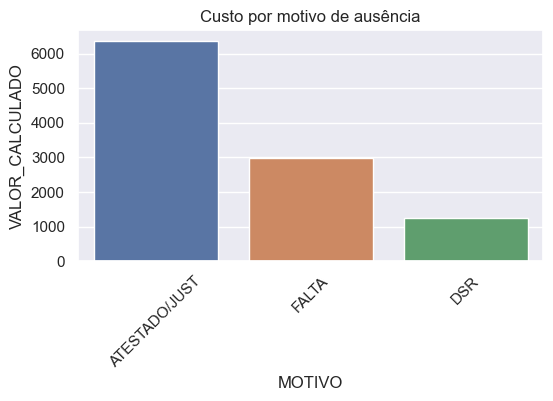

# Analise-Dados-Python

 Chegou até mim a necessidade de analisar o custo que a empresa estava tendo com atestados e quais empregados tinham menor assiduidade, para ajudar na descisão de quais empregados deveriam ser demitidos ou quais deveriam obter promoção.

 Então analisei essas informações obtendo os número para a descisão ser justa.

Para visualizar todas as análises: [Clique aqui!](https://github.com/CatiusciScheffer/Python/blob/main/Analise_de_Dados_comparando-empregados-para-reduzirquadro/dadosAusenciasEmpregados.ipynb)

