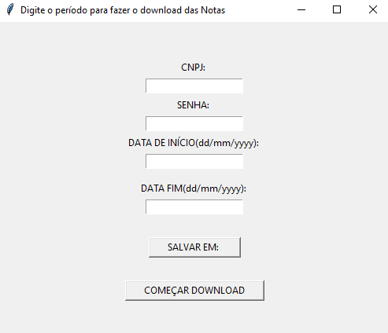
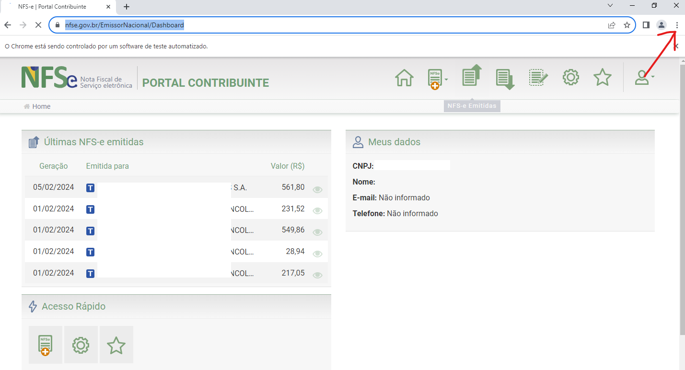
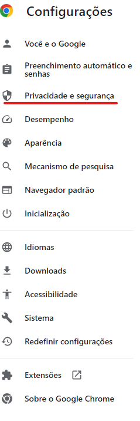
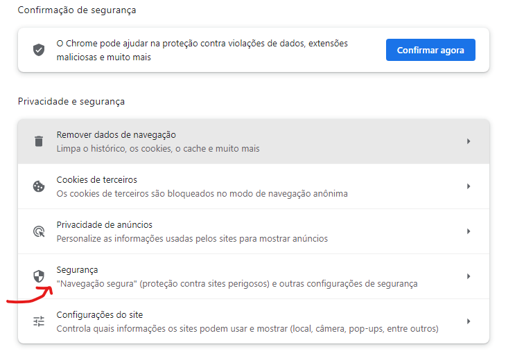
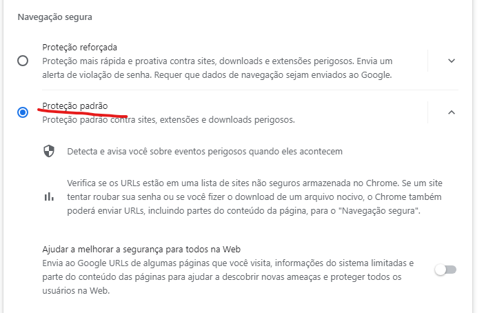

<h1>Automação Download XML NFSE Emissor Nacional</h1>

- [Repositório no GitHub](https://www.linkedin.com/in/catiuscipagnonceli-cienciasdacomputacao/)

<h2>Objetivo do programa:</h2>

Este programa foi desenvolvido para atender às necessidades dos escritórios de contabilidade, facilitando a importação automatizada de XMLs de notas fiscais emitidas pelos clientes. A automação agiliza o processo de download dos XMLs do portal "Emissor Nacional".

O programa percorre todas as páginas com a lista de notas, fazendo o download apenas das notas que correspondem ao período especificado pelo usuário. Um relatório em formato txt é gerado, incluindo a lista de todas as notas no portal, indicando quais foram baixadas.

Caso esteja vendo isso e precise de ajuda ou queira alguma automação para ganhar tempo no seu dia a dia basta me contactar:

- [Contato Linkedin](https://www.linkedin.com/in/catiuscipagnonceli-cienciasdacomputacao/)

<h4>Instruções de Instalação e Uso:</h4>

1. Salve a pasta chamada "Profile Selenium" na pasta do usuário que executará o sistema. O caminho completo seria: AppData\Local\Google\Chrome\User Data.
   * [Link para baixar a pasta "Profile Selenium"](https://github.com/CatiusciScheffer/Python/tree/19ba4b7dbd10b0c7ec3673f2d9cf61352924489f/Automacao_Baixar%20NFE_Gov/Profile%20Selenium)
  
2. Salve o arquivo executável da pasta "exe" em qualquer local desejado e execute-o.
   * [Link para baixar o arquivo executável](https://github.com/CatiusciScheffer/Python/tree/19ba4b7dbd10b0c7ec3673f2d9cf61352924489f/Automacao_Baixar%20NFE_Gov/exe)
 >`  `  
   
    

3. Preencha os dados acima com os mesmos dados de acesso ao portal "Emissor Nacional" CNPJ, SENHA e especifique o período desejado para o download dos XMLs (por exemplo, de início a partir de 1/2/2024 até 29/2/2024).

4. Clique no botão **"SALVAR EM"** para definir o local de salvamento dos XMLs das notas de serviço.

5. Por fim, clique em **"COMEÇAR DOWNLOAD"**.

<h4>Durante a primeira execução, siga estes passos adicionais:</h4>

>Nas demais execuções basta executar o arquivo .exe que foi salvo preenchendo os dados e o programa fará os downloads conforme parametros que o usuário passar. Caso as instruções abaixo não sejam feitas o Download poderá ser bloqueado pelo Chrome ou a cada XML será solicitado local para salvar.

* Nesta página do Chrome que abriu, enquanto o programa vai rodando será necessário **apenas na primeira execução** clicar em **** da barra de navegação e configurar a segurança do Chrome da seguinte maneira:
 
>`  `
>
 

>`  `

 

>`  `

 

>`  `

 

>`  `

 

* Verifique se a pasta padrão para Download definida é a pasta "Downloads", se não for, configure para que seja.