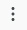
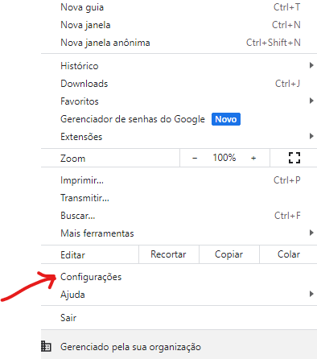

<h1>Automação Download XML NFSE Emissor Nacional</h1>

<h2>Objetivo do programa:</h2>

Este programa foi desenvolvido para atender às necessidades dos escritórios de contabilidade, facilitando a importação automatizada de XMLs de notas fiscais emitidas pelos clientes. A automação agiliza o processo de download dos XMLs do portal "Emissor Nacional".

<h4>Instruções de Instalação e Uso:</h4>
1. Salve a pasta chamada "Profile Selenium" na pasta do usuário que executará o sistema. O caminho completo seria: AppData\Local\Google\Chrome\User Data.

2. Salve o arquivo executável da pasta "exe" em qualquer local desejado e execute-o.

3. Preencha os dados de login do portal "Emissor Nacional" e especifique o período desejado para o download dos XMLs (por exemplo, de 1/2/2024 a 29/2/2024).

4. Clique no botão "SALVAR EM" para definir o local de salvamento dos XMLs das notas de serviço.

5. Por fim, clique em "COMEÇAR DOWNLOAD".

<h4>Durante a primeira execução, siga estes passos adicionais:</h4>

* Nesta página do Chrome que abriu, enquanto o programa vai rodando será necessário **apenas na primeira execução** clicar em **** da barra de navegação e configurar a segurança do Chrome da seguinte maneira:
 

* Verifique se a pasta padrão para Download definida é a pasta "Downloads", se não for, configure para que seja.

>Nas demais execuções basta executar o arquivo .exe que foi salvo preenchendo os dados e o programa fará os downloads conforme parametros que o usuário passar na tela conforme imagem abaixo:
  

  
O programa percorre todas as páginas com a lista de notas, fazendo o download apenas das notas que correspondem ao período especificado pelo usuário. Um relatório em formato txt é gerado, incluindo a lista de todas as notas no portal, indicando quais foram baixadas.

Caso esteja vendo isso e precise de ajuda ou queira alguma automação para ganhar tempo no seu dia a dia basta me contactar:

- [Contato Linkedin](https://www.linkedin.com/in/catiuscipagnonceli-cienciasdacomputacao/)