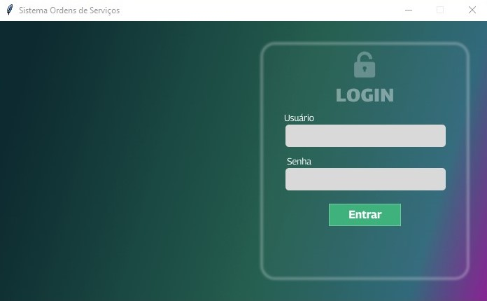
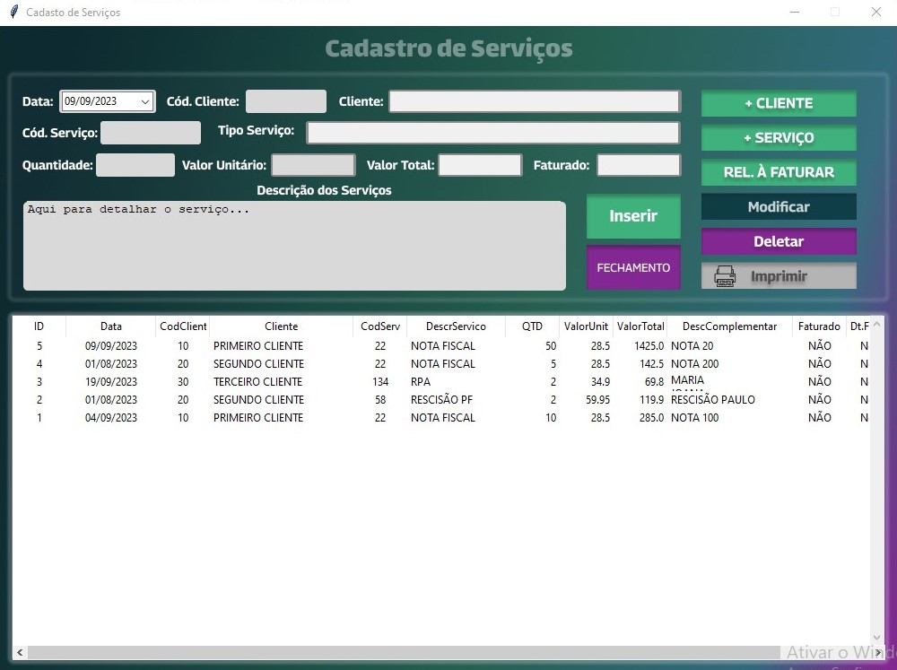
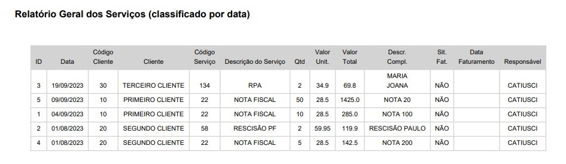
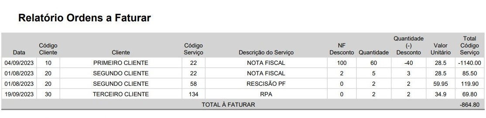
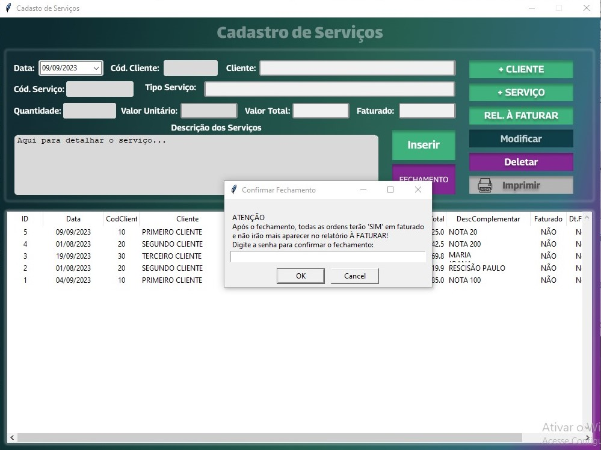
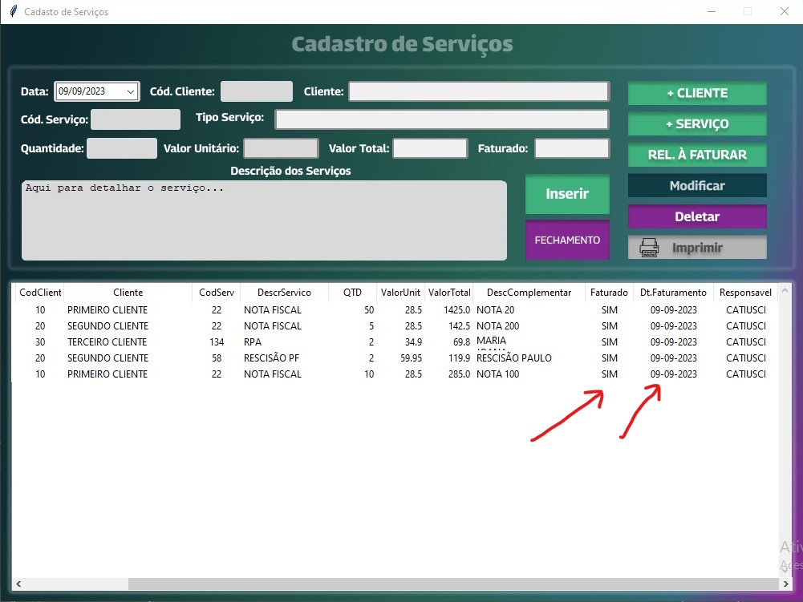
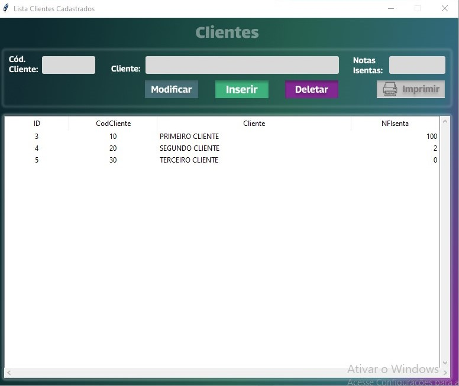
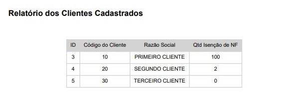
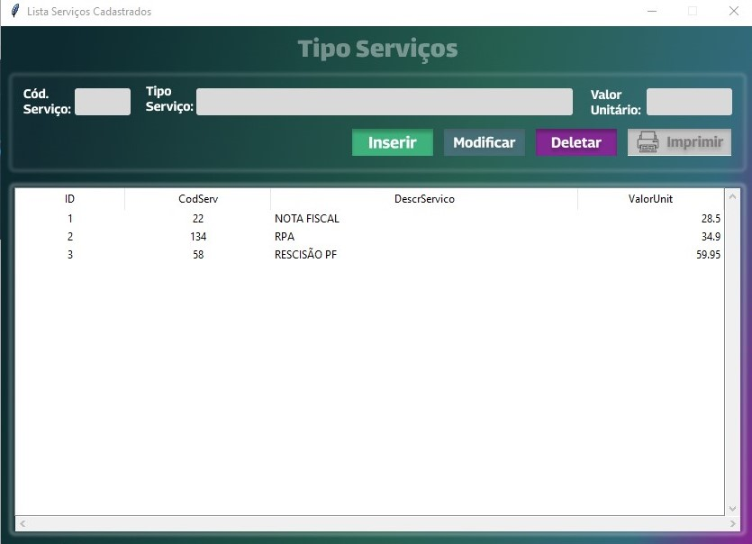
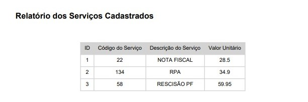

### SISTEMA DE ORDENS DE SERVIÇOS

Criei este sistema para colocar em prática meus estudos de python com tkinter, e banco de dados relacional.

Foi um desafio que propus pra mim mesma de criar algo com que já tinha estudado sem ser recriando um projeto da faculdade, curso ou youtube, etsou muito feliz pois resolvi cada problema que tive ao longo da criação deste programa por conta própria e com isso aprendi muito mais.

As janelas eu usei o figma pra desenhas, o proxlight designer para gerar o código a partir do figma o que me poupou muito tempo, usei SQLite que pra esta situação era o ideal.

O sistema tem tela de login, com verificação de usuário ou cadastro automático do mesmo, após o login parte para a tela principal onde são lançadas as ordens de serviço, nesta tela principal temos acesso ao cadastro de novos clientes e dos serviços, por fim é possível gerar vários relatórios e além disso fazemos o fechamento das ordens em aberto para o financeiro efetuar a cobrança, este relatório de fechamento agrupa a cobrança por cliente e por tipo de serviço, além de descontar nas situações de determinado serviço conforme contrato do cliente.

Por ser uma necessidade interna todos os valores digitados são alterados para letra maiúscula para que haja uma padronização.

A função de "MODIFICAR" em todas as telas apaga os demais botões deixando apenas o botão criado pra este fim de "SALVAR MODIFICAÇÕES".

**Abaixo os links para visitar reposítório e até baixar o executável:**
- [Link para baixar a pasta com arquivo executável;](https://github.com/CatiusciScheffer/Python/blob/main/SistemaOrdemServico/executavel/SistemaRetrabalho.zip)
- [Link para o repositório;](https://github.com/CatiusciScheffer/Python/tree/main/SistemaOrdemServico)
- [Link tela principal no Figma;](https://www.figma.com/file/4ap5dK4azpuPBBXEneyREf/Principal?type=design&node-id=0-1&mode=design&t=FSXtDVzmgzSF2N7q-0)
- [Link tela cadastro de cliente no Figma;](https://www.figma.com/file/XEjd8SDFPqkoOYPwZTqaAk/Cadastro-Cliente?type=design&mode=design&t=FSXtDVzmgzSF2N7q-0)
- [Link para tela de cadastro de serviço no Figma;](https://www.figma.com/file/aeJRtn2lLWXx7HFVL3GlZE/Cadastro-Servicos?type=design&node-id=0-1&mode=design&t=pX7DaG6vs187YeRc-0)

Abaixo vou colocar as imagens das telas e a funcionalidade do sistema.

---

###### Tela Login

Nesta tela é possível logar com verificação se o usuário existe e se a senha está correta, caso não exista o mesmo é cadastrado automáticamente e emitida mensagem de sucesso, o nome do usuário independente de como for digitado será passado para letra maiúscula e a senha será convertida em hash. Não é o mais seguro, mas atende a necessidade específica.

---

###### Tela Principal

Nesta tela se o cliente e o serviço já estiverem cadastrados basta colocar o código dos mesmos e dar TAB que o input cliente e tipo serviço são preenchidos automáticamente, assim como após preencher o serviço o valor unitário também é preenchido, a situação faturado aparece mas não é editavel aqui nesta tela, somente após o fechamento pelo setor financeiro como vou mostrar adiante.

O valor total é calculado automáticamente após a quantidade e valor unitário preenchidos.

Cada ordem de serviço é inserida no topo da tabela ao fim da tela, mas caso haja necessidade de ordenar por cliente por exemplo, basta clicar no cabeçalho da tabela e a ordenação acontece.

Podemos imprimir todas as ordens desta tabela clicando no botão de "IMPRIMIR", o mesmo é gerado por ordem decrescente de data, o relatório fica assim:

Agora para saber o que está em aberto para ser faturado podemos clicar em "REL. À FATURAR", as ordens em aberto estão com a situação igual a "NÃO":

Neste relatório há um agrupamento por cliente, posteriormente por tipo de serviço e se for o caso do serviço ter código 22 então o cliente pode ter uma quantidade de notas isentas de cobrança que aparecen na coluna desconto, este valor é definido no cadastro do cliente, se for o caso é dado desconto conforme quantidade em contrato. Tendo então o total descriminado por cliente e por serviço feito.

Uma vez por mês o financeiro irá efetuar o fechamento clicando no botão "FECHAMENTO", onde irá primeiro pedir onde salvar o relatório acima automáticamente, posteriormente aparecerá a seguinte tela:

Nesta tela é necessário ter a senha e após confirmar o fechamento todas as ordens passam a ter a situação de "Faturado" igual a "SIM" e a data dde fechamento é preenchida automáticamente com a data atual do fechamento conforme abaixo:

Após o fechamento a coluna "Faturado" estará com o valor "SIM", a partir desse momento será impossível deletar ou modificar o item da tabela, tendo em vista que o mesmo já foi feito e cobrado do cliente.

---

###### Cadastro de Cliente

Este cadastro fiz bem básico porque onde usamos temos outro sistema com cadastro completo de cliente, então aqui poderia ser desta maneira pra facilitar. O campo de Notas Isentas é o que será calculado o desconto falado acima.

Os clientes são inseridos na tabela por ordem de inserção, mas podem ser reorganizado confome clique no cabeçalho da coluna.

Tem os dados mínimos que precisamos neste contexto e todas as operações de CRUD e ao clicar em "IMPRIMIR" gera o seguinte relatório:

---

###### Cadastro de Serviço

Este cadastro também tem a intenção e necessidade de ser simples e rápido com os dados necessários para situação.

Os Serviços são inseridos na tabela por ordem de inserção, mas podem ser reorganizado confome clique no cabeçalho da coluna.

Ao clicar em "IMPRIMIR" gera o seguinte relatório:

---
