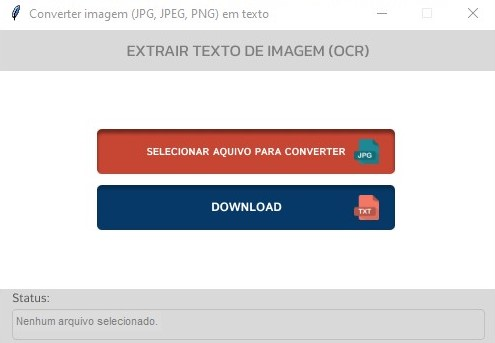

# Conversor de imagem (JPG, JPEG, PNG) em TXT

No meu dia a dia tenho que fazer diversas alterações contratuais dos mais diversos tipos, pra isso muitas vezes tenho apenas o arquivo digital em pdf de arquivo digitalizado, fazendo com que eu tenha que redigir várias página para poder alterar e dar continuidade no processo. Por isso resolvi fazer este programinha que recebe imagem e tranforma em texto.

Inicialmente não estava reconhecendo a acentuação do português,extraindo os textos com alguns erros ortográfico, pra resolver isso fiz algumas pesquisar e consegui mesclando vários códigos obter a solução.

Me atende a já me ajudou uitas vezes, faço print da minha tela mesmo do documentos que tenho que reescrever para modificar, salvo como JPG e converto em texto com este programa básico mas funcional.

Tentei fazer bem simples e intuitivo pois não serei eu apenas a usar, então clicamos no primeiro botão para selecionar o arquivo de imagem e após selecionar o arquivo basta clicar no botão de download e escolher onde salvar o arquivo de texto com nome desejado.

Para utilizar basta fazer o download de todos os arquivos contidos na pasta Executavel_ConvertIMGtoTXT neste link abaixo e após download, executar o arquivo chamado 'conversorIMGtoTXT.exe'.

  [Clique aqui para download do Conversor.](https://github.com/CatiusciScheffer/Python/tree/main/extraindo-texto-de-imagem/Executavel_ConvertIMGtoTXT)
