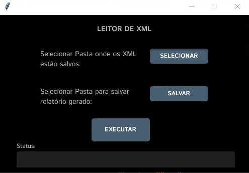

# LEITOR XML GENÉRICO (lê todo o xml e passa para excel)

  Desenvolvi este leitor de xml que é capaz de ler e exportar para o excel qualquer xml, independente se é nota fiscal de serviço, danfe ou do e-social.

  Este programa lê qualquer arquivo xml, coloca cada informação em uma coluna do excel e com isso podemos entrar no excel e deixar apenas as informações desejadas para cada situação.

  Como trabalho em escritório contábil, preferi fazer este leitor mais genérico, sem regras e extração de informações pré-definidas pois assim ele se aplica a qualquer arquivo que tenha extensão xml, tornando útil em todos os departamentos, não apenas para ler notas fiscais.

  Para que qualquer um pudesse usar mesmo não sendo programador, criei uma interface simples no tkinter, utilizando o figma para desenhar a janela e o Proxlight Designer para gerar o código do tkinter o que tornou bem mais rápida a geração da interface.

  

  O uso é bem simples, basta o usuário selecionar a pasta onde tenha um arquivo ou vários arquivos xml, seleciona a pasta onde gerar o arquivo excel com as informações extraídas dos xml e clica em executar para começar o processo. No status irá aparecer o caminho onde foi salvo o excel gerado ou se der erro tambem irá aparecer neste local.

  Após feito e testado o programa gerei o arquivo de distribuição para poder criar o executável e poder instalar em qualquer computador, o mesmo está disponível para download no link abaixo:
  <strong>

  [Link para baixar o executável.](https://github.com/CatiusciScheffer/Python/blob/main/ler_XML/arquivo_Executavel/LeitorXML.rar)
  
  </strong>

  Basta baixar a pasta LeitorXML e executar o arquivo LeitorXML.exe.

